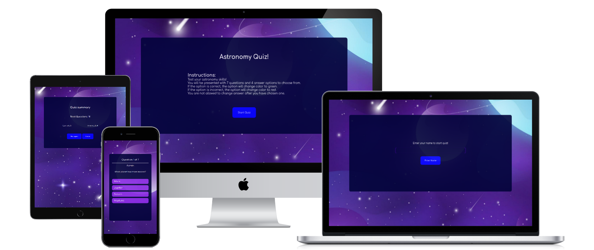
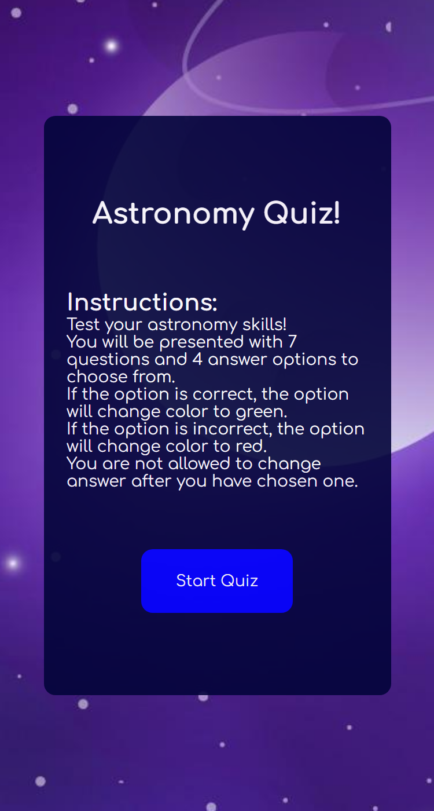

# Astronomy Quiz
This is a hobby project.
This is the link to the website: 
https://frirsta.github.io/quiz/

## Features
### Startpage

### Enter name

### Quiz

### Summary

## Technologies
* JavaScript
* HTML
* CSS

## Sources

Favicon:
<a href="https://www.flaticon.com/free-icons/universe" title="universe icons">Universe icons created by Freepik - Flaticon</a>

Background:
Image by <a href="https://www.freepik.com/free-vector/gradient-galaxy-background_14658088.htm#query=galaxy&position=9&from_view=search&track=robertav1">Freepik</a>
